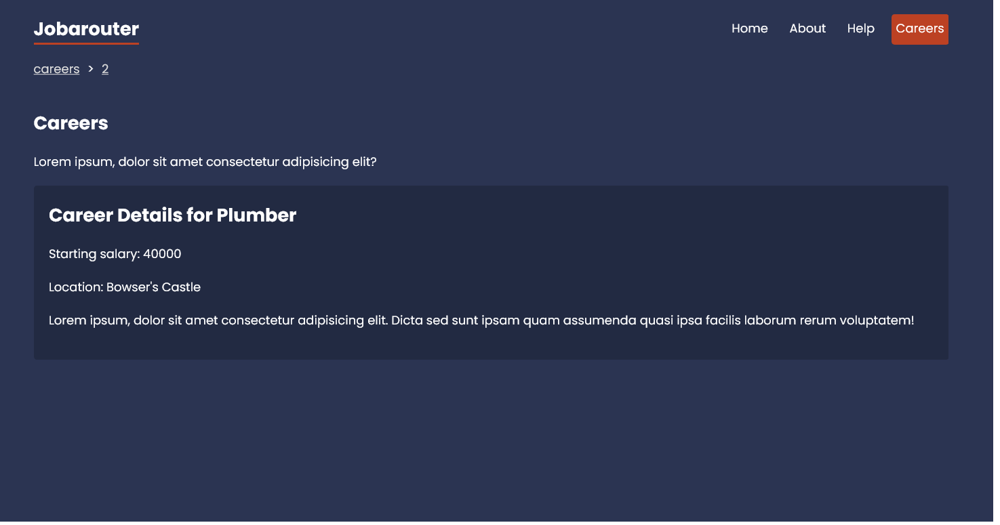

# Jobarouter - React Router Practice

This is a simple practical application for practicing React Router. It has multiple pages and routes.
This project was bootstrapped with [Create React App](https://github.com/facebook/create-react-app).

## Technologies

- JSX,CSS
- ES6
- React
- **react-router-dom** package for routing
- **Hooks:** useParams,useLoaderData useLocation, useRouteError

## Features

- Nested Routs
- 404 route
- Route Params
- Loaders
- Error Element
- BreadCrump using useLocation hook
- Form
- Navigate Link to redirect

## Installation

Install **DojaRouter** with npm

```shell
npm install

npm run start

json-server -p 4000 -w data/db.json
```

## Screenshots


